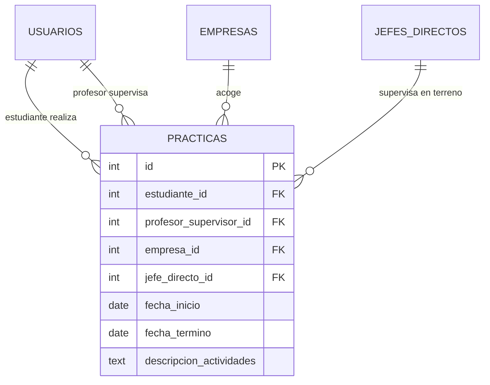

# BRIEF — Sistema de Gestión de Prácticas Profesionales

**Versión:** 1.0
**Fecha:** 2026-09-03
**Estado:** Documento de alcance y especificación inicial

---

## 1. Resumen del proyecto

Aplicación web para administrar las **prácticas profesionales** de estudiantes de un colegio técnico. Permite registrar prácticas, asociarlas a empresa, jefe directo y profesor supervisor, y controla el acceso según el rol del usuario (estudiante o profesor) mediante RBAC.

## 2. Objetivos

- Centralizar el registro de prácticas profesionales en una sola aplicación web.
- Permitir que cada estudiante gestione y consulte **únicamente sus propias prácticas**.
- Permitir que los profesores supervisen **todas las prácticas** con control total (crear, leer, actualizar, eliminar).
- Entregar una interfaz simple, clara y usable (Bootstrap) para usuarios no técnicos.

## 3. Alcance

### Dentro del alcance

- Autenticación de usuarios (registro y login) con contraseñas cifradas (Argon2) y sesiones JWT.
- CRUD de prácticas con control de permisos por rol (RBAC).
- Registro de datos base: estudiante, profesor, empresa, jefe directo.
- Vistas renderizadas en servidor (Handlebars) con Bootstrap.
- Validación de entrada en servidor con Zod.

### Fuera del alcance (v1)

- Flujo de aprobación/corrección de prácticas por parte del profesor (solo CRUD directo).
- Adjuntos o evidencias (documentos, certificados).
- Asignación automática de profesor supervisor.
- Panel de administración global (gestión de usuarios).
- API pública / consumo desde otros sistemas.

## 4. Normas de desarrollo (obligatorias)

Estas reglas aplican a todo el trabajo y son verificables en revisión de código:

- **Código en inglés:** identificadores, funciones, archivos, nombres de tablas/columnas, constantes y mensajes internos se escriben en inglés (`fullName`, `createPractice`, `trainingPlan`). El código fuente no contiene texto en español.
- **Interfaz de usuario en español:** toda la UI visible se muestra en español (es-CL): etiquetas, botones, títulos, mensajes de error/validación, fechas (`dd/mm/aaaa`) y textos. El inglés queda solo en el código, nunca en pantalla.
- **Buenas prácticas, código limpio y principios SOLID:** nombres descriptivos, funciones pequeñas de una sola responsabilidad, separación de capas (rutas → servicios → repositorios → DB → vistas), DRY (cero duplicación), sin código muerto ni `TODO` pendientes, dependencias explícitas e inyección de dependencias donde aporte.
- **Frontend con Bootstrap y skill `frontend-design`:** toda la UI se construye con Bootstrap 5 y la dirección del diseño (layout, componentes, jerarquía visual, responsividad) se realiza mediante el skill `frontend-design` del entorno de desarrollo.
- **TypeScript y programación funcional (sin clases):** todo el código se escribe en TypeScript; se evita el uso de clases y se aplica programación funcional: funciones puras y pequeñas de una sola responsabilidad, composición de funciones, datos inmutables y sin estado mutable compartido ni efectos secundarios ocultos.
- **Documentación actualizada antes de implementar librerías:** antes de implementar o integrar cualquier librería, leer la última documentación oficial usando `context7`; no asumir APIs ni versiones de memoria.

## 5. Actores y permisos (RBAC)

| Rol | Atributos | Permisos sobre prácticas |
|---|---|---|
| **ESTUDIANTE** | Nombre completo, RUT, Carrera | Crear práctica · Leer **sus propias** prácticas |
| **PROFESOR** | Nombre completo, RUT, Especialidad | Crear práctica · Leer **todas** las prácticas · Actualizar práctica · Eliminar práctica |

### Matriz de permisos

| Acción | Estudiante | Profesor |
|---|---|---|
| Crear práctica | ✔ | ✔ |
| Leer práctica propia | ✔ (solo las suyas) | ✔ |
| Leer cualquier práctica | ✘ | ✔ |
| Actualizar práctica | ✘ | ✔ |
| Eliminar práctica | ✘ | ✔ |

Regla de negocio: un estudiante solo puede ver/consultar prácticas donde `estudiante_id == su propio id`. El profesor no tiene restricciones de lectura sobre ninguna práctica.

## 6. Modelo de datos

### 6.1 `usuarios`

| Campo | Tipo | Restricciones |
|---|---|---|
| `id` | INTEGER | PK, autoincrement |
| `rut` | TEXT | Único, normalizado (formato `XX.XXX.XXX-X`) |
| `nombre_completo` | TEXT | Obligatorio |
| `password_hash` | TEXT | Hash Argon2id |
| `rol` | TEXT | `estudiante` \| `profesor` |
| `carrera` | TEXT | Obligatorio si `rol = estudiante`, nulo si profesor |
| `especialidad` | TEXT | Obligatorio si `rol = profesor`, nulo si estudiante |
| `created_at` / `updated_at` | TEXT | Timestamps |

### 6.2 `empresas`

| Campo | Tipo | Restricciones |
|---|---|---|
| `id` | INTEGER | PK |
| `nombre` | TEXT | Obligatorio |
| `direccion` | TEXT | Obligatorio |
| `telefono` | TEXT | Obligatorio |

### 6.3 `jefes_directos`

| Campo | Tipo | Restricciones |
|---|---|---|
| `id` | INTEGER | PK |
| `nombre` | TEXT | Obligatorio |
| `contacto` | TEXT | Obligatorio (teléfono o correo) |
| `cargo` | TEXT | Obligatorio |

### 6.4 `practicas`

| Campo | Tipo | Restricciones |
|---|---|---|
| `id` | INTEGER | PK |
| `estudiante_id` | INTEGER | FK → `usuarios.id` (rol estudiante) |
| `profesor_supervisor_id` | INTEGER | FK → `usuarios.id` (rol profesor) |
| `empresa_id` | INTEGER | FK → `empresas.id` |
| `jefe_directo_id` | INTEGER | FK → `jefes_directos.id` |
| `fecha_inicio` | TEXT | Obligatorio (ISO `YYYY-MM-DD`) |
| `fecha_termino` | TEXT | Obligatorio; debe ser ≥ `fecha_inicio` |
| `descripcion_actividades` | TEXT | Obligatorio, no vacío |
| `created_at` / `updated_at` | TEXT | Timestamps |

### Diagrama ER



## 7. Stack tecnológico

| Pieza | Tecnología | Responsabilidad |
|---|---|---|
| Framework web | **Hono** | Servidor HTTP, enrutado, middlewares, SSR |
| Motor de plantillas | **Handlebars** | Vistas HTML renderizadas en servidor |
| ORM | **Drizzle ORM** | Definición de esquema, consultas tipadas |
| Base de datos | **SQLite** (driver `better-sqlite3`) | Persistencia embebida |
| Validación | **Zod** | Schemas de entrada (registro, login, práctica) |
| Autenticación | **JWT** | Token de sesión (cookie httpOnly) |
| Autorización | **RBAC** (middleware propio) | Guardas por rol y por propiedad |
| Hash de contraseñas | **Argon2** (argon2id) | Cifrado de `password_hash` |
| UI/CSS | **Bootstrap 5** + skill `frontend-design` | Estilos, componentes, responsividad, diseño visual |

## 8. Arquitectura

```
┌────────────────────────────────────────────────────┐
│  HTML + Bootstrap  ←  Handlebars (SSR)            │
└──────────────────────┬─────────────────────────────┘
                       │
┌──────────────────────▼─────────────────────────────┐
│  Hono app                                           │
│  ┌───────────────┐  ┌───────────┐  ┌────────────┐   │
│  │ middleware    │  │ routes    │  │ zod        │   │
│  │  · auth (JWT) │→ │  /auth    │→ │ validate   │   │
│  │  · rbac (rol) │  │  /practicas│ │ schemas    │   │
│  │  · ownership  │  └───────────┘  └────────────┘   │
│  └───────────────┘                                   │
└──────────────────────┬─────────────────────────────┘
                       │
┌──────────────────────▼─────────────────────────────┐
│  Drizzle ORM  →  SQLite                            │
└────────────────────────────────────────────────────┘
```

### Capas y flujo típico (crear práctica)

1. `GET /practicas/nueva` → middleware `auth` verifica JWT (cookie httpOnly) → render de formulario.
2. `POST /practicas` → middleware `auth` → validación **Zod** (si falla, re-render con errores) → insert en SQLite vía Drizzle → redirect a `GET /practicas`.
3. Consultas de listado aplican filtro según rol: estudiante → `WHERE estudiante_id = :id`; profesor → sin filtro.

## 9. Autenticación y autorización

### Registro y login

| Ruta | Método | Acceso | Descripción |
|---|---|---|---|
| `/auth/registro` | GET/POST | Público | Crear cuenta (rol + datos según rol) |
| `/auth/login` | GET/POST | Público | Autenticar con RUT + contraseña |
| `/auth/logout` | POST | Autenticado | Invalidar sesión (borrar cookie) |

- La contraseña se cifra con **Argon2id** (`hash` y `verify` de `argon2`).
- Al autenticar se emite un **JWT** firmado (secret en `.env`), con `exp` definida; se guarda en cookie `httpOnly` + `SameSite=Lax` y renovada si es pertinente.
- El JWT lleva `sub` (id de usuario) y `rol` para autorización sin re-consultas.

### Middlewares RBAC

- `authRequired` — rechaza peticiones sin JWT válido (redirect a `/auth/login`).
- `requireRol('profesor')` — permite solo al rol indicado (403 en caso contrario).
- `ownerOrProfesor` — para lectura de práctica: permite si `rol = profesor` o si `practica.estudiante_id === usuario.id`.

## 10. Rutas de prácticas

| Ruta | Método | Estudiante | Profesor | Descripción |
|---|---|---|---|---|
| `/practicas` | GET | ✔ (propias) | ✔ (todas) | Listado |
| `/practicas/nueva` | GET | ✔ | ✔ | Formulario de creación |
| `/practicas` | POST | ✔ | ✔ | Crear práctica |
| `/practicas/:id` | GET | ✔ (solo propia) | ✔ | Detalle |
| `/practicas/:id/editar` | GET | ✘ | ✔ | Formulario de edición |
| `/practicas/:id` | POST | ✘ | ✔ | Actualizar práctica |
| `/practicas/:id/eliminar` | POST | ✘ | ✔ | Eliminar práctica |

Notas:

- El estudiante que crea la práctica queda asignado automáticamente como `estudiante_id` (no puede elegir otro estudiante).
- El `profesor_supervisor_id` se elige entre usuarios con rol `profesor` (combo en el formulario).

## 11. Reglas de validación (Zod)

| Entrada | Reglas |
|---|---|
| `registro` | RUT formato válido y único, nombre no vacío, contraseña ≥ 8 caracteres, `carrera` requerida si rol estudiante, `especialidad` requerida si rol profesor |
| `login` | RUT y contraseña obligatorios |
| `practica` | `estudiante_id` debe ser usuario rol estudiante · `profesor_supervisor_id` debe ser usuario rol profesor · `fecha_inicio` y `fecha_termino` obligatorias y en formato ISO · `fecha_termino ≥ fecha_inicio` · `descripcion_actividades` no vacía · `empresa_id` / `jefe_directo_id` FK existentes |
| `empresa` | nombre, dirección y teléfono obligatorios |
| `jefe_directo` | nombre, contacto y cargo obligatorios |

Los errores de validación se muestran en la vista (mensajes en español), conservando los valores ya ingresados.

## 12. Interfaz de usuario (Bootstrap)

- Layout base Handlebars: navbar con marca del sistema, vínculos según rol y botón de logout; footer.
- Páginas: login, registro, listado de prácticas (tabla), detalle de práctica, formulario crear/editar (2 vistas reutilizando un partial de formulario).
- Listado muestra: estudiante, empresa, jefe directo, fechas, descripción resumida y acciones según rol (ver siempre; editar/eliminar solo profesor).
- Formulario de práctica con secciones: datos de la práctica (fechas, descripción), empresa (nombre, dirección, teléfono), jefe directo (nombre, contacto, cargo) y profesor supervisor (select).
- Fechas con `<input type="date">`; mensajes de validación bajo cada campo; tablas responsivas (`table-responsive`).
- Vistas protegidas redireccionan a login; acceso no autorizado muestra vista 403.
- La UI se diseña con el skill `frontend-design` del entorno; el texto visible siempre en español y el código de las vistas en inglés.

## 13. Requerimientos no funcionales

- **Idioma:** interfaz y mensajes en español (es-CL), fechas en `dd/mm/aaaa` en vistas; código fuente en inglés (sección 4).
- **Seguridad:** contraseñas Argon2id, sesión JWT en cookie httpOnly, validación estricta en servidor (Zod), consultas parametrizadas vía Drizzle (sin SQL concatenado).
- **Usabilidad:** formularios con feedback de error, navegación clara por rol.
- **Rendimiento:** listados paginados o limitados por estudiante; sin sobreconsultas (joins con Drizzle).
- **Mantenibilidad:** esquema tipado de Drizzle, middlewares reutilizables, schemas Zod compartidos entre rutas y vistas.

## 14. Criterios de aceptación

1. Un estudiante puede registrarse (RUT + nombre + carrera), iniciar sesión y **crear** una práctica con su empresa, jefe directo y profesor supervisor.
2. Un estudiante **no puede** ver prácticas de otros estudiantes (recibe 403 / no aparecen en el listado).
3. Un profesor puede registrarse (RUT + nombre + especialidad), iniciar sesión y **ver todas** las prácticas, **editar** y **eliminar** cualquier práctica.
4. Un estudiante **no puede** editar ni eliminar prácticas (botones ausentes y guarda en servidor).
5. No se puede crear una práctica con `fecha_termino < fecha_inicio`, campos vacíos o FKs inexistentes.
6. Las contraseñas se almacenan únicamente como hash Argon2; el login con RUT + contraseña correcta emite JWT y protege `/practicas`.
7. La interfaz es responsiva (desktop y móvil) con Bootstrap y navegable por un usuario no técnico.

## 15. Supuestos y decisiones abiertas

- **Credenciales:** el stack incluye Argon2 y JWT, por lo que se asume autenticación por **RUT + contraseña** con registro de usuarios incluido. *Confirmar si los usuarios se crean por registro público o los carga un administrador.*
- **Empresa y jefe directo:** se modelan como entidades propias reutilizables; en v1 el formulario de práctica permite crearlos y seleccionarlos. *Alternativa: catálogo previo mantenido por profesores.*
- **Eliminación:** borrado físico del registro (no soft-delete) en v1.
- **Sesión:** JWT en cookie httpOnly (SSR); *alternativa JWT en header `Authorization` si se requiere API.*
- **Rango de fechas:** fecha de término puede ser posterior al día actual (prácticas en curso o futuras), sin restricción adicional.

## 16. Etapas de implementación

Cada etapa es autocontenida: se planifica, se implementa y se prueba de forma independiente, en orden. Una etapa termina solo cuando cumple su criterio de salida (columna «Cómo se prueba»); recién ahí se avanza a la siguiente.

| # | Etapa | Qué se implementa | Cómo se prueba (criterio de salida) | Estado |
|---|---|---|---|---|
| 1 | Scaffold del proyecto | App Hono + TypeScript arrancando; Handlebars como motor de vistas; Drizzle + better-sqlite3 conectados; script `npm run dev`; layout base con Bootstrap. | `npm run dev` levanta la app sin errores y `GET /` renderiza la vista base con Bootstrap cargado. | ✔ Ejecutada |
| 2 | Esquema y datos base | Migraciones Drizzle que crean `usuarios`, `empresas`, `jefes_directos` y `practicas` con sus FKs; script de seed con datos mínimos (2 estudiantes, 2 profesores, 1 empresa, 1 jefe directo). | Las 4 tablas existen en SQLite con sus FK; consultar la base devuelve los datos del seed. | Pendiente |
| 3 | Registro de usuarios | `GET/POST /auth/registro`; validación Zod (RUT válido y único, nombre, contraseña ≥ 8, carrera/especialidad según rol); hash Argon2id antes de insertar. | Un registro crea el usuario con `password_hash` (nunca texto plano); RUT duplicado o datos inválidos muestran mensajes en español y conservan lo ya ingresado. | Pendiente |
| 4 | Login, logout y sesión JWT | `GET/POST /auth/login` y `POST /auth/logout`; JWT firmado en cookie httpOnly + SameSite=Lax; middleware `authRequired`. | Login con RUT + contraseña correctos emite la cookie y redirige; credenciales erróneas muestran error; `/practicas` sin sesión redirige a login; logout elimina la cookie. | Pendiente |
| 5 | RBAC y ownership | Middlewares `requireRol('profesor')` y `ownerOrProfesor` aplicados a las rutas de prácticas. | Matriz de permisos de la sección 5 verificada en servidor: estudiante recibe 403 al editar/eliminar y al abrir práctica ajena; profesor accede a todas. | Pendiente |
| 6 | CRUD de prácticas: crear y listar | `GET /practicas/nueva`, `POST /practicas`, `GET /practicas`; formulario con secciones práctica/empresa/jefe/profesor; creación de empresa y jefe desde el form; validación Zod completa; listado en tabla filtrado por rol. | Estudiante crea una práctica (queda como `estudiante_id` automático) y el listado solo muestra las suyas; profesor ve todas; cada regla de validación de la sección 11 falla con su mensaje en español. | Pendiente |
| 7 | CRUD de prácticas: detalle, editar, eliminar | `GET /practicas/:id`, `GET/POST /practicas/:id/editar`, `POST /practicas/:id/eliminar`; partial de formulario compartido entre crear/editar; botones de acción según rol. | Profesor edita y elimina una práctica y los cambios persisten en la base; estudiante no ve los botones y recibe 403 si fuerza la ruta; eliminación física. | Pendiente |
| 8 | Pulido de UI y cierre | Diseño final con Bootstrap 5 y skill `frontend-design`: responsividad, vista 403, errores bajo cada campo, fechas en `dd/mm/aaaa`, navegación por rol. | Recorrido completo en desktop y móvil (registro → login → crear → listar → detalle → editar/eliminar) sin errores; criterios de aceptación 1–7 cumplidos. | Pendiente |

## 17. Hitos sugeridos

| # | Hito | Criterio de salida |
|---|---|---|
| 1 | Scaffold Hono + Handlebars + SQLite/Drizzle | App arranca y sirve una vista base |
| 2 | Esquema de datos + migraciones Drizzle | Tablas `usuarios`, `empresas`, `jefes_directos`, `practicas` creadas |
| 3 | Auth: registro, login, JWT, passwords Argon2 | Login correcto emite JWT; rutas protegidas responden |
| 4 | Middlewares RBAC (rol + propiedad) | Matriz de permisos de la sección 5 verificada en servidor |
| 5 | CRUD de prácticas con validación Zod | Todos los criterios de aceptación 1–6 cumplidos |
| 6 | Vistas Bootstrap + feedback de errores | Aceptación 7; revisión visual en desktop y móvil; UI diseñada con skill `frontend-design` |